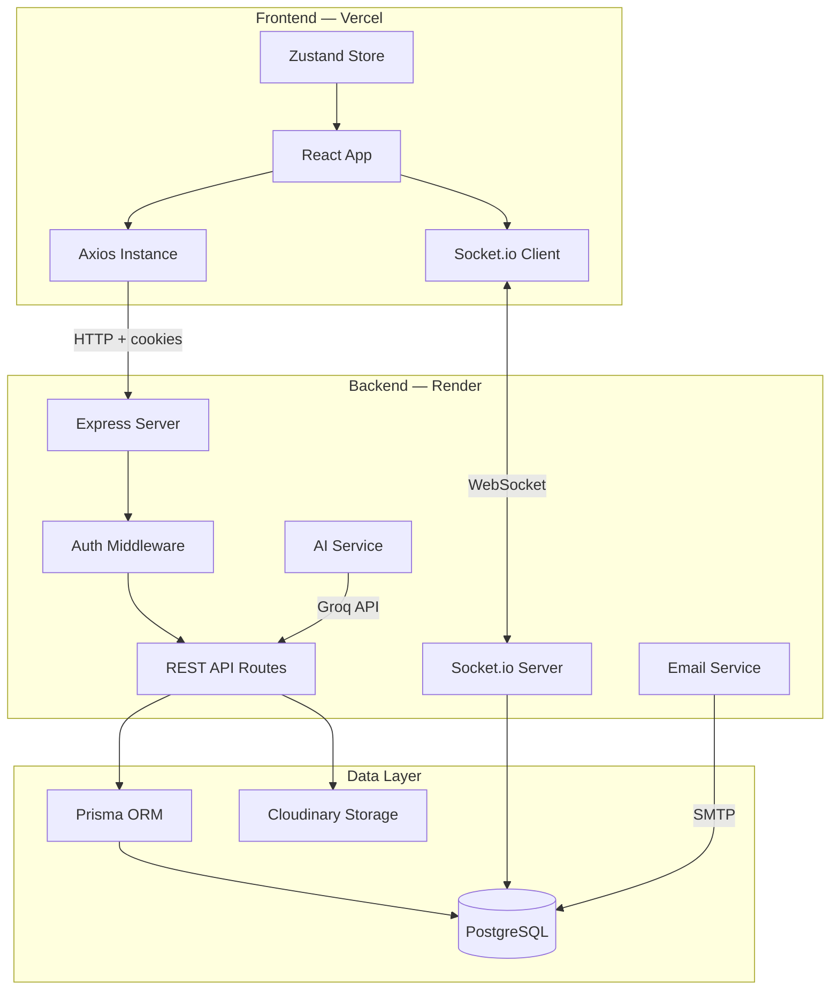
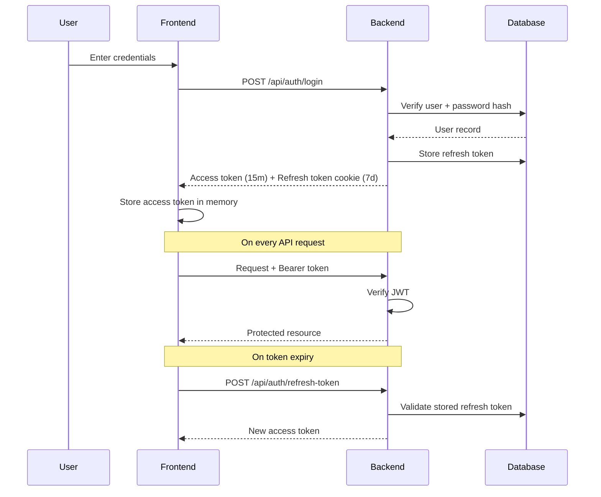
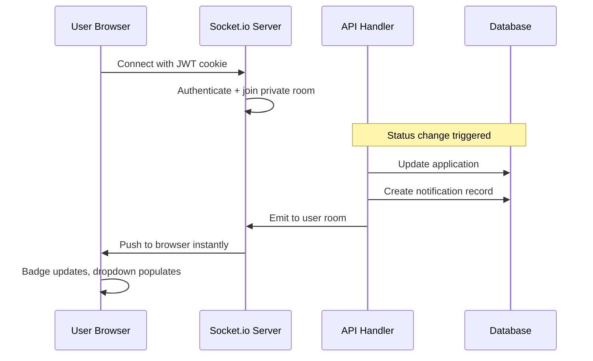

# CareerTrack

A full-stack job application tracking system built for serious job seekers. CareerTrack replaces scattered spreadsheets with a structured, intelligent workspace — tracking every application, follow-up, and interview in one place, with real-time updates and AI-powered insights.

**Live Demo:** https://job-application-tracker-theta-khaki.vercel.app

## Preview


## What It Does

Most job seekers lose track of applications within weeks. CareerTrack solves this with a complete pipeline view, automated reminders, activity heatmaps, and an AI assistant that analyzes your resume against specific job descriptions — all in a single production-deployed application.

## Features

**Application Management**
- Full pipeline tracking with 7 status stages from Applied to Accepted
- Duplicate detection, bulk actions, and application cloning
- Timestamped notes timeline per application
- CSV export of all data

**Dashboard and Analytics**
- Real-time stats — total applications, response rate, active interviews, offers received
- Smart insight engine that surfaces the most relevant observation from your data
- Weekly activity tracker and pipeline funnel
- Response rate benchmarked against industry average

**Calendar**
- Monthly calendar view with color-coded event dots
- 26-week activity heatmap showing application consistency over time
- Hover tooltips with company and event details
- Upcoming follow-ups and deadlines panel

**Real-Time Notifications**
- Socket.io powered live notifications — no polling required
- Persisted to database, survives page refresh
- Bell badge with unread count, mark all read, per-notification delete

**Email Alerts**
- Confirmation on every new application
- Status change notifications
- Follow-up and interview reminders
- Respects per-user notification preferences from Settings

**AI Assistant**
- Resume analysis against a specific job description
- Resume optimization with keyword gap identification
- Interview preparation with role-specific talking points
- Powered by Groq API

**Document Management**
- Resume upload and cloud storage
- Cover letters, certifications, and portfolio links
- PDF preview with proxy streaming
- Link resumes to specific applications

**Settings**
- Profile management and password change
- Granular notification preferences
- JSON data export and account deletion

## Tech Stack

| Layer | Technology |
|---|---|
| Frontend | React 18, Vite, React Router v6 |
| Styling | CSS Variables, Tailwind utilities, Lucide Icons |
| State | Zustand, TanStack Query |
| Backend | Node.js, Express 5 |
| Database | PostgreSQL, Prisma ORM |
| Real-time | Socket.io |
| Auth | JWT with httpOnly cookies |
| File Storage | Cloudinary |
| Email | Nodemailer |
| AI | Groq API |
| Deployment | Vercel + Render |

## Architecture



## Authentication Flow



## Real-Time Notification Flow



## Project Structure

```
job-tracker/
│
├── Frontend/
│   ├── src/
│   │   ├── api/                  API modules per domain
│   │   ├── assets/               Logos and static files
│   │   ├── components/
│   │   │   ├── common/           DatePicker, shared UI components
│   │   │   └── layout/           MainLayout, Sidebar, Header
│   │   ├── hooks/                useNotifications hook
│   │   ├── pages/
│   │   │   ├── applications/     List, Detail, Form views
│   │   │   ├── analytics/        Charts and insights
│   │   │   ├── calendar/         Monthly view and heatmap
│   │   │   ├── dashboard/        Stats and pipeline
│   │   │   ├── documents/        File management
│   │   │   └── settings/         User preferences
│   │   └── store/                Zustand auth store
│   └── index.html
│
└── Backend/
    └── src/
        ├── controllers/          Business logic per domain
        ├── middleware/           Auth, error handling, rate limiting
        ├── routes/               Express route definitions
        ├── services/             Email and AI service layers
        ├── utils/                Validation and helper utilities
        └── socket.js             Socket.io setup and room management
```

## Getting Started

**Prerequisites:** Node.js 18+, PostgreSQL database, Cloudinary account, Groq API key

**Clone and install**

```bash
git clone https://github.com/upasanaprabhakar/job-tracker.git
cd job-tracker
```

**Backend setup**

```bash
cd Backend
npm install
```

Create a `.env` file in the Backend folder with your own values for database connection, JWT secrets, Cloudinary credentials, email config, and Groq API key. Refer to `.env.example` if provided.

```bash
npx prisma migrate dev
npm run dev
```

**Frontend setup**

```bash
cd ..
npm install
```

Create a `.env` file in the root with:

```
VITE_API_URL=http://localhost:5000
```

```bash
npm run dev
```

The app runs at `http://localhost:5173`

## Deployment

**Backend on Render**
- Build command: `npm install && npx prisma generate && npx prisma migrate deploy`
- Start command: `npm start`
- Set all required environment variables in the Render dashboard
- Set `NODE_ENV=production`

**Frontend on Vercel**
- Framework preset: Vite
- Add `VITE_API_URL` pointing to your Render backend URL

## Security Considerations

- Passwords hashed with bcryptjs
- JWT access tokens expire in 15 minutes
- Refresh tokens stored server-side, expire in 7 days
- httpOnly cookies prevent XSS token theft
- CORS restricted to known frontend origins
- Rate limiting on all API routes
- No secrets committed to version control

## Author

**Upasana Prabhakar**

## License

MIT